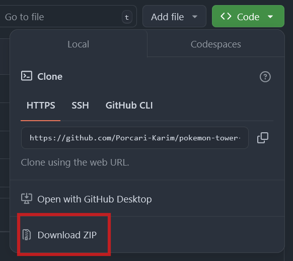
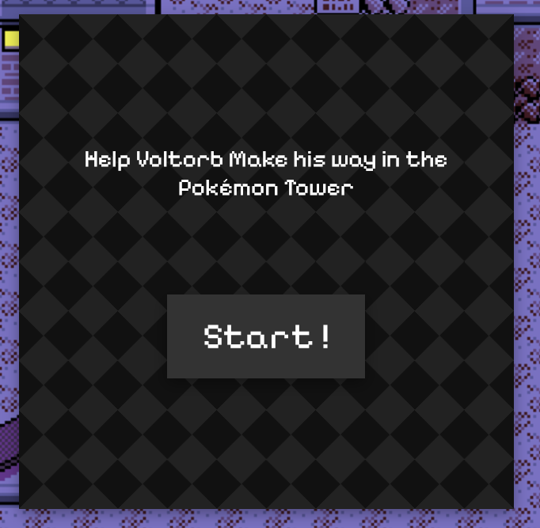
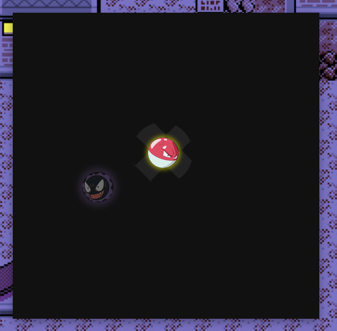
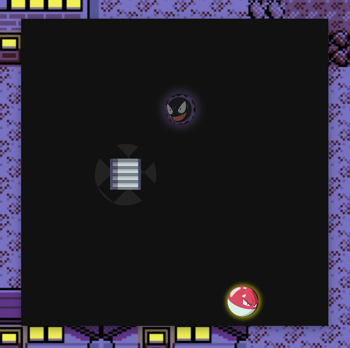
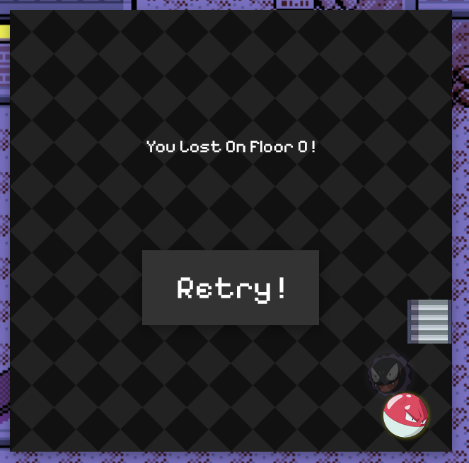

# **Lavender's Town Pokémon Tower Climb**

## **Presentation:**

This repository contains a small game built in a week during my remote bootcamp at Ironhack.\
The aim of this project is to check our understanding of the DOM and our DOM manipulation knowledge using Javascript.\
Therefore the use of any JS framework or the Canvas element are strictly prohibited.

## **How To Play:**

> First of all the game is accessible for free thanks to Github Pages [here](https://porcari-karim.github.io/pokemon-tower-climb/).
> 
But if you still want to get the game locally the only thing you need to do is download the ZIP of the repository:

And that's it ! As the game is built using vanilla JS there is no other build or deployment steps.

## **Game Rules:**

The games objective is to help Voltorb find his way inside of Lavender's city Pokémon Tower.\
But that won't be that easy, since the tower is shrouded in darkness.
Moreover the tower is filled with Gastlys who aren't very welcoming...

### Let's get throught all the game controls and how the game works

You can move Voltorb using ***WASD*** or using the ***Arrow Keys***

You can move the spotlight using you ***Mouse*** and use it to find ***Stairs***

Pay attention ! If Voltorb gets hit by a ***Gastly*** he will go all the way back to the pokécenter...

### **Try to go as far as possible!**